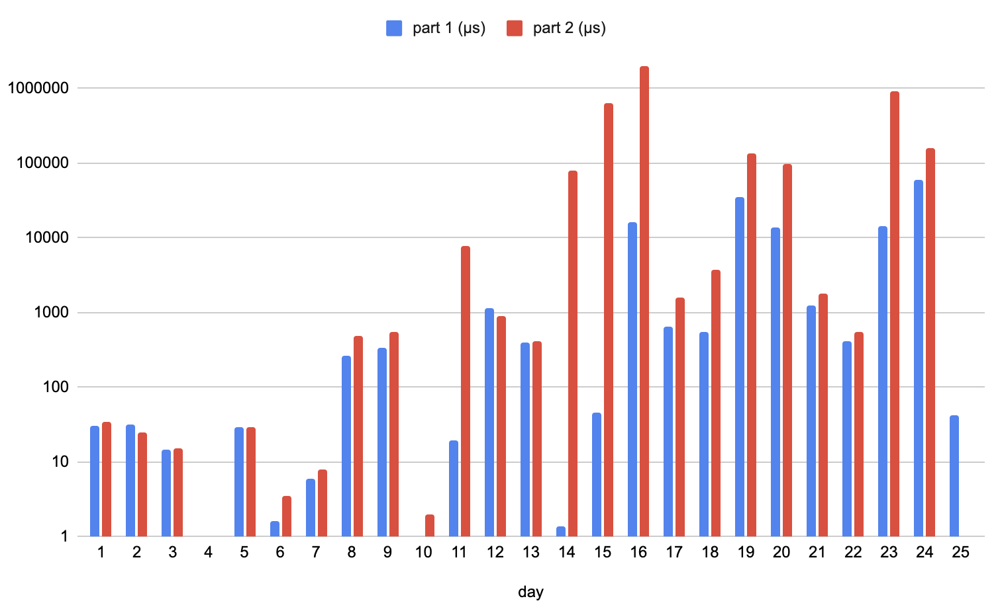

# Advent of Code 2022

## Final Thoughts
These are my solutions for Advent of Code 2022. It was my first time doing AoC and I decided to use it to learn Rust. Overall this went pretty well; I was able to get every star, and have some basic competency in the language.

AoC is definitely not a _great_ way to learn a language; it rewards writing quick-and-dirty code to get an answer quickly, rather than doing this "correctly" but more slowly. It also only explores a limited subset of the language: string processing, movement/pathfinding on a grid, some basic simulation stuff, etc. The problems simply aren't deep or complex enough to need much more.

I'll be following this up by going through [Rustlings](https://github.com/rust-lang/rustlings) to get a better foundation in Rust, then [Cryptopals](https://cryptopals.com/) to learn while building something more complex with it.

## Interesting solutions
For the most part AoC is mostly about getting to the same solution as everyone else, but there are a few that I'm particularly proud of.

### [Day 4](https://github.com/glasir/aoc22/blob/main/src/day4.rs)
My solution here is exceptionally fast (~500ns per part, not including parsing) by using an extremely efficient interval-overlap test.

### [Day 6](https://github.com/glasir/aoc22/blob/main/src/day6.rs)
I built a specialized `HashMap` for counting characters in the sliding window that is _much_ more efficient.

### [Day 13](https://github.com/glasir/aoc22/blob/main/src/day13.rs)
My entire parser was about six lines of code:
```rust
fn parse_data(data: &str) -> IResult<&str, Data> {
    alt((
        map(i32, Data::Int),
        map(
            delimited(tag("["), separated_list0(tag(","), parse_data), tag("]")),
            Data::List,
        ),
    ))(data)
}
```
`nom` is awesome.

### [Day 16](https://github.com/glasir/aoc22/blob/main/src/day16.rs)
This was the first really heavyweight optimization problem. I took a bunch of steps to get my runtime down to about 2 seconds:

1. Build a complete graph over all rooms with non-zero flow. Eliminate all other rooms.
2. Replace room names with integers so lookups for flows and distances to other rooms can be done by indexing flat arrays instead of using hashmaps.
3. Represent the set of "active" rooms with a custom bitset implementation instead of e.g. `HashSet`. This makes lookup faster and allows for extremely efficient generation of partitions of the set of rooms.

### [Day 19](https://github.com/glasir/aoc22/blob/main/src/day19.rs)
Again, this is an optimization problem over a very large search space. It turns out I enjoy those a lot!

Optimizations:
1. Rather than considering what to do during each minute, consider what robot to build next. (This is the same idea as generating the complete graph of rooms in day 16.)
2. Using a byte-packed `u32` as a very efficient/cursed way to represent resources and costs.
3. Never build more ore robots than the highest ore cost (etc.)
4. Don't bother simulating the last 1-2 minutes (where a lot of branching happens) since there are so few useful paths.
5. Don't track counts of geodes or geode robots, just add the geode count to the output as soon as you decide to build a geode bot.
6. If you can build a geode bot, do so and don't explore any other options.

The last one is actually invalid in general but requires a somewhat pathological input to break. The rest are guaranteed to work.

This got my runtime for part 2 down to slightly under 2 seconds, which is much better than most other solutions I looked at!

### [Day 25](https://github.com/glasir/aoc22/blob/main/src/day25.rs)
Rather than the obvious "convert each SNAFU number to native format; add; convert back for display" approach, I built a basic implementation of balanced quinary from scratch. All computations are done symbolically, and there are no conversions to decimal or native-format integers at all.

Writing out the addition table was a bit annoying, but otherwise this went surprisingly smoothly, and it was really cool to see it spit out the correct answer on basically the first try.

## Benchmarks
Here are the timing for my solutions. In general I was not trying for the fastest possible solution (except for e.g. days 16 and 19), but overall things ended up being quite fast in general:



Some notes/caveats:
* Timings were measured with `cargo aoc bench`, which does not include the parsing stage in its timings. This mostly affected e.g. day 10, where the benchmarks reported that the solution took an astonishing **7 nanoseconds** on average - because the expensive part was parsing strings and generating an array of values, which wasn't counted.
* All benchmarks were computed on an M2 Macbook Air. Hilariously, this was dramatically faster than my aging desktop.
* As always, YMMV.

As a fun side note:
 * the solutions for part 1 had a total runtime of 0.14 seconds;
 * the solutions for part 2 had a total runtime of 4.04 seconds;
 * the total runtime of all solutions was **4.18 seconds**.

So I suppose that I completed AoC 2022 in less than five seconds. Neat!


## Thoughts for next year
There were a few things that I'd do differently for next year.

* Prep a helper library with a few things that came up repeatedly:
  * A `Grid` type that handles moving around a 2- or 3-D grid
  * Specific `Row` and `Col` types to avoid using the wrong "type" of integer in functions
  * Some kind of basic graph library
* Have a better template. I made a crappy template on day 1 and had to fix its issues every day thereafter.
* Don't try to solve every problem immediately. This added a lot of stress, especially as the problems became more complex and AoC transitioned from being "a thing I do each night" to "_the_ thing I do each night". Much better to take some work hours the next day.
